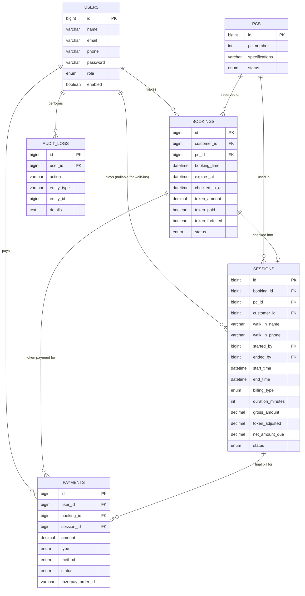

# Database Schema

MySQL 8, InnoDB, `utf8mb4`. Full DDL is in `database/schema.sql`; seed data (10 PCs + 3 demo accounts) is in `database/seed.sql`.

## Entity-Relationship Diagram

## Design notes

`sessions.booking_id` is nullable because a session can originate from either a checked-in online reservation or a staff-initiated walk-in; `sessions.customer_id` is likewise nullable, with `walk_in_name`/`walk_in_phone` populated instead for anonymous walk-ins.

`bookings.pc_id` is nullable in the schema (though always populated in practice once auto-assignment succeeds) so the column can safely hold historical bookings if PC auto-assignment logic ever changes to support pre-assignment-then-confirm flows.

`payments` has independent nullable FKs to both `bookings` and `sessions` because a single customer can have two distinct payment events: the ₹50 token at booking time, and the final bill settlement at session end — these can use different payment methods (Razorpay for the token, cash for the final bill).

Indexes are placed on every status column (`pcs.status`, `bookings.status`, `sessions.status`, `payments.status`) since the scheduler, dashboards, and staff views all filter heavily by status, plus on `bookings.booking_time` and `audit_logs.created_at` for time-range queries.
